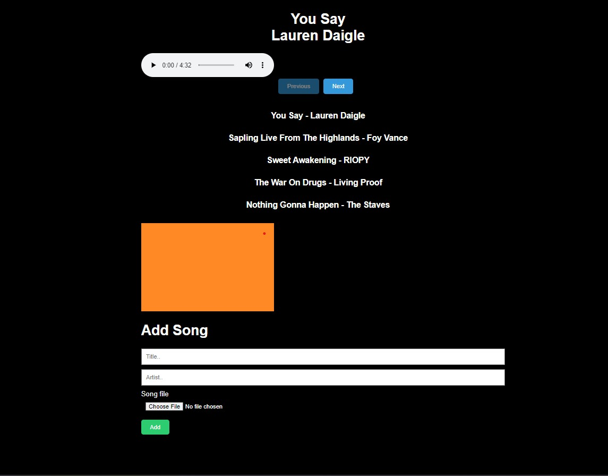

# Exciting Open-Source Project Alert: Emotion Detection & Mood-based Music Player 🌟🎶🌈

Are you passionate about technology, machine learning, and web development? We are thrilled to announce an open-source project that combines these interests into one captivating application! 💻🎵 ⭐

## Introduction

This open-source project aims to create an emotion detection and mood-based music player application. The project leverages facial emotion detection, JavaScript, Django, HTML/CSS, and cutting-edge machine learning techniques. It employs the VGGNet model and OpenCV library to accurately recognize facial emotions and provide a customized music experience based on the detected mood. 🎭🎧

## Getting Started

To contribute to this project, follow the steps below:

1. **Clone the and Start the repository**: Clone this repository to your local machine using the following command:

2. **Install the dependencies**: Navigate to the project's directory and install the required dependencies using the following command:

3. **Set up the environment**: Follow the instructions in the `README.md` file to set up the necessary environment for the project, including installing the required libraries and frameworks.

4. **Explore the code**: Familiarize yourself with the project's code structure, including the frontend and backend components.

5. **Run the project :** Run the project on localhost ``` localhost:http://127.0.0.1:8000/```

6. **Pick an issue**: Visit the repository's issue tracker to find a list of open issues. Pick an issue that aligns with your skills or interests and leave a comment expressing your intention to work on it. If you have an innovative idea or bug fix not listed in the issues, feel free to create a new issue and discuss it with the maintainers.

7. **Create a new branch**: Create a new branch for your work using a descriptive branch name. For example:

8. **Make your changes**: Implement the necessary code changes to address the chosen issue or add the new feature. Ensure that your code follows the project's coding style and conventions.

9. **Test your changes**: Before submitting your code, thoroughly test it to ensure that it functions as expected and does not introduce any regressions.

10. **Commit and push**: Commit your changes and push them to your forked repository:

11. **Create a pull request**: Visit the original repository on GitHub and create a pull request from your forked repository. Provide a clear and detailed description of the changes you made and link it to the corresponding issue.

12. **Review and address feedback**: Collaborate with the maintainers and address any feedback or suggestions they provide. Make the necessary changes and update your pull request.

13. **Celebrate your contribution**: Once your pull request is approved and merged, your code will be part of the project! Congratulations on your contribution!


## Clone the repository
* Clone the repository : 
[Clone the repository](https://github.com/harshkasat/Facial_emotions)

* ```git init```

* ``` git clone https://github.com/harshkasat/Facial```

## Install the dependencies

* To install dependencies first you need to make a python environment. Use this command in cmd in the specified directory

* ``` Python version 3.11.2```
* Create Python environment:
 ``` python -m venv .venv ```
* Activate Python environment:
 ``` .\.venv\Scripts\activate```

* To install dependencies
``` pip install -r requirements.txt ```

* To deactivate the Python environment
 ``` deactivate ```


## Run the project 

* First go to the song directory
 ``` cd song```
* To run the project server
* ``` python manage.py runserver```

<br>

## Demo of the webpage 
<br>


# Contributing Guidelines

Before you start working on the project, please review our [contributing guidelines](CONTRIBUTING.md) for more information on how to contribute effectively and maintain code quality.

# Code of Conduct

We are committed to providing a friendly, safe, and welcoming environment for all contributors. Please review our [code of conduct](CODE_OF_CONDUCT.md) to understand our expectations and how to report any unacceptable behaviour.

# Contact

If you have any questions or need further assistance, feel free to reach out to us. Let's connect and inspire each other! 🔗

# License
